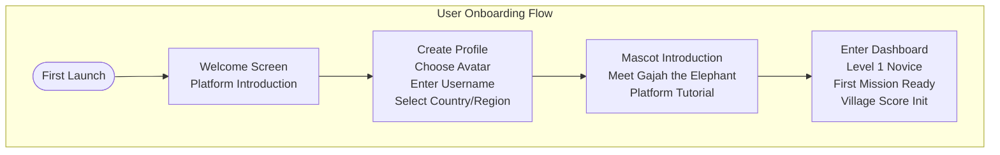
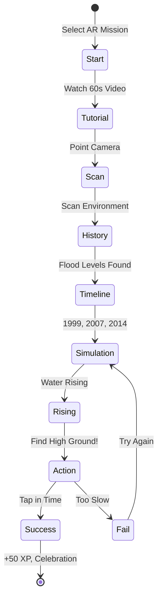
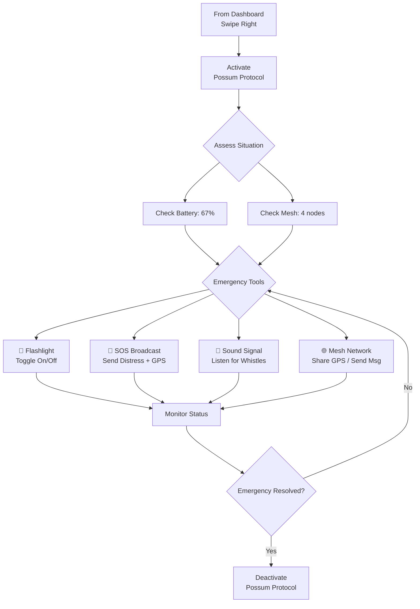
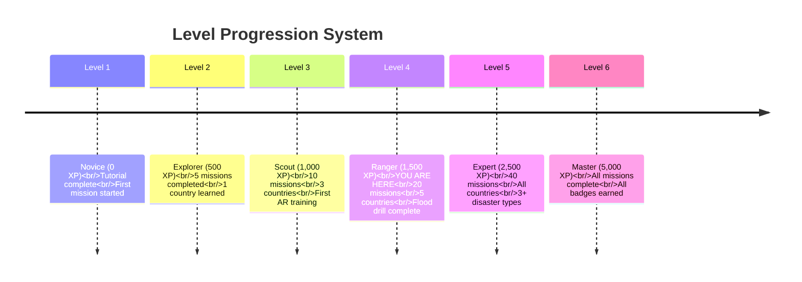
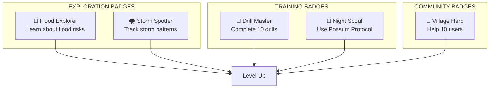
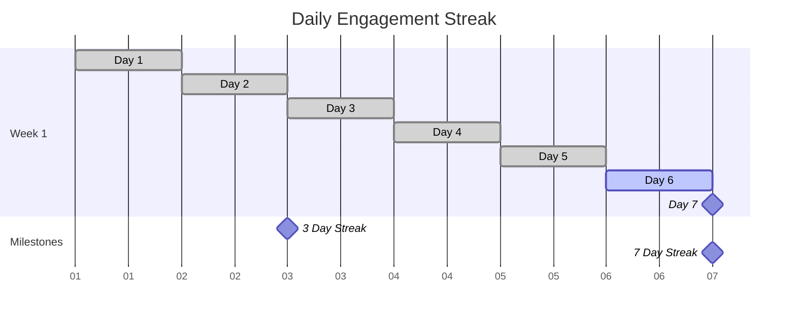
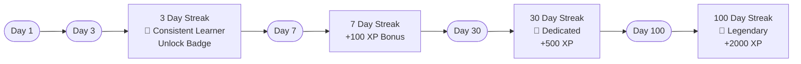

# AI Disaster Resilience Platform

> A gamified, mobile-first disaster preparedness education platform for children and families across the ASEAN region.


---

## Table of Contents

- [What is This Platform?](#what-is-this-platform)
- [System Overview](#system-overview)
- [Complete User Journey](#complete-user-journey)
- [Feature Deep Dives](#feature-deep-dives)
- [Gamification System](#gamification-system)
- [Technology Stack](#technology-stack)
- [Installation & Setup](#installation--setup)

---

## What is This Platform?

The AI Disaster Resilience Platform is an **educational web application** that teaches disaster preparedness through **gamified learning experiences**. Designed specifically for the ASEAN region, it combines:

- **Real disaster data** from 10 ASEAN countries
- **Interactive AR-based training** for flood, earthquake, and other disasters
- **Emergency survival tools** that work offline (Possum Protocol)
- **Community-driven safety scores** (Village system)
- **Child-friendly design** with mascots, badges, and rewards

### The Problem It Solves

Natural disasters claim thousands of lives across ASEAN annually. Many deaths are preventable through proper education and preparation. However, traditional disaster training is often:

- Boring and lecture-based
- Too scary for children
- Not accessible in local languages
- Forgotten quickly

### Our Solution

**Learning through play** — Children and families learn life-saving skills through:
- Interactive maps and disaster history exploration
- AR simulation training that feels like a game
- Earning XP, badges, and leveling up
- Streaks and daily challenges to maintain engagement
- Emergency tools that work when networks are down

---

## System Overview

### The Four Main Modules

```
┌─────────────────────────────────────────────────────────────────┐
│                    AI DISASTER RESILIENCE                       │
├─────────────────────────────────────────────────────────────────┤
│                                                                  │
│  ┌─────────────┐  ┌─────────────┐  ┌─────────────┐  ┌─────────┐│
│  │  DASHBOARD  │  │   ATLAS     │  │     AR      │  │ POSSUM  ││
│  │             │  │             │  │  TRAINING   │  │PROTOCOL ││
│  │ Home Base   │  │  Map Explore│  │ Simulation  │  │Emergency││
│  │ Progress    │  │  Disaster   │  │  History    │  │ Tools   ││
│  │ Missions    │  │   Data      │  │  Practice   │  │ Offline ││
│  └─────────────┘  └─────────────┘  └─────────────┘  └─────────┘│
│                                                                  │
└─────────────────────────────────────────────────────────────────┘
```

### How The System Works

```mermaid
flowchart LR
    Start([Sign Up<br/>Create Profile]) --> Learn[Learn About<br/>Disasters<br/>(Atlas)]
    Learn --> Practice[Practice<br/>via AR Training]
    Practice --> Earn{Earn XP & Badges}
    Earn --> LevelUp[Level Up]
    Earn --> Unlock[Unlock New Missions]
    LevelUp --> Return(Return to Dashboard)
    Unlock --> Return
    Return --> Practice
```

```mermaid
flowchart TD
    subgraph Modules["Four Main Modules"]
        Dashboard["🏠 Dashboard<br/>Home Base<br/>Progress & Missions"]
        Atlas["🗺️ Atlas<br/>Map Explorer<br/>Disaster Data"]
        AR["👁️ AR Training<br/>Simulation<br/>Practice Drills"]
        Possum["🦝 Possum Protocol<br/>Emergency Tools<br/>Offline Survival]
    end

    Dashboard --> Atlas
    Dashboard --> AR
    Atlas --> EarnXP["Earn XP"]
    AR --> EarnXP
    EarnXP --> Dashboard
    Dashboard --> Possum
```

---

## Complete User Journey

### Phase 1: Getting Started



### Phase 2: Daily Usage Loop

```mermaid
flowchart TD
    Open([Open App<br/>Daily Streak ++]) --> Check[Check Dashboard<br/>Weather Alert<br/>Progress Bar]
    Check --> Select[Select Mission<br/>From Daily List]
    Select --> Mission{Mission Type}

    Mission --> Complete[Complete Mission<br/>Earn XP<br/>+50-100 XP]
    Mission --> Learn[Learn Disaster<br/>History<br/>(Atlas)]

    Complete --> Progress[Progress Saved]
    Learn --> Progress

    Progress --> CheckReward{Reward Check}
    CheckReward -->|Level Up| LevelUp[Level Up<br/>New Content Unlocked]
    CheckReward -->|Badge Earned| Badge[Badge Unlocked<br/>Celebration]
    CheckReward -->|No Reward| Return([Return to Dashboard])

    LevelUp --> Return
    Badge --> Return
    Return --> Select
```

---

## Feature Deep Dives

### 1. Dashboard — Command Center

**Purpose:** Your home base showing progress, missions, and alerts.

```
┌──────────────────────────────────────────────────────────────┐
│  ┌────────┐  ┌──────────────────┐  ┌──────────────────┐     │
│  │ Avatar │  │ Weather Alert    │  │ Progress: 80%    │     │
│  │ Level 4│  │ ⚠️ Flood Warning │  │ 1,240 / 1,500 XP │     │
│  └────────┘  └──────────────────┘  └──────────────────┘     │
│                                                              │
│  ┌────────────────────────────────────────────────────────┐ │
│  │              DAILY MISSIONS                             │ │
│  │  ┌────────┐  ┌────────┐  ┌────────┐  ┌────────┐      │ │
│  │  │Explore │  │AR Hunt │  │Quake   │  │Quiz    │      │ │
│  │  │History │  │Treasure│  │Drill   │  │Challenge│      │ │
│  │  │+30 XP  │  │+50 XP  │  │+40 XP  │  │+20 XP  │      │ │
│  │  └────────┘  └────────┘  └────────┘  └────────┘      │ │
│  └────────────────────────────────────────────────────────┘ │
│                                                              │
│  ┌────────────────────────────────────────────────────────┐ │
│  │                    YOUR BADGES                          │ │
│  │  🏆 Flood Explorer    🌪️ Storm Spotter   🔒 Safety Hero│ │
│  └────────────────────────────────────────────────────────┘ │
│                                                              │
│  ┌────────────────────────────────────────────────────────┐ │
│  │        ←─ SWIPE RIGHT FOR EMERGENCY TOOLS ─────────→    │ │
│  └────────────────────────────────────────────────────────┘ │
└──────────────────────────────────────────────────────────────┘
```

**User Flow:**
1. Open app → Land on Dashboard
2. Check weather alert banner (real-time disaster warnings)
3. Review XP progress toward next level
4. Scroll through daily missions
5. Tap mission card to begin

---

### 2. Atlas — Explore Disaster Data

**Purpose:** Interactive map showing disaster risks across 10 ASEAN countries.

```
┌──────────────────────────────────────────────────────────────┐
│                     🔍 Search countries...                  │
│                                                              │
│  ┌────────────────────────────────────────────────────────┐ │
│  │                                                        │ │
│  │   🇵🇭                  🇻🇳                          │ │
│  │ Philippines              Vietnam                       │ │
│  │ Typhoon Risk              Typhoon Risk                  │ │
│  │                                                        │ │
│  │        🇲🇲         🇹🇭     🇱🇦    🇰🇭              │ │
│  │      Myanmar    Thailand  Laos  Cambodia              │ │
│  │    Cyclone     Flood    Flood   Flood                 │ │
│  │                                                        │ │
│  │  🇮🇩                                    🇲🇾          │ │
│  │ Indonesia                              Malaysia       │ │
│  │ Volcano                                Flood           │ │
│  │                                                        │ │
│  │                  🇸🇬                                 │ │
│  │               Singapore                              │ │
│  │               Heat Risk                               │ │
│  └────────────────────────────────────────────────────────┘ │
│                                                              │
│  ┌────────────────────────────────────────────────────────┐ │
│  │  🇵🇭 Philippines — Typhoon Risk                        │ │
│  │                                                        │ │
│  │  📍 RISK PROFILE                                       │ │
│  │  Located in the Pacific typhoon belt with an average   │ │
│  │  of 20 typhoons per year. High exposure to storm       │ │
│  │  surges, flooding, and landslides.                     │ │
│  │                                                        │ │
│  │  🌀 COMMON PATTERNS                                    │ │
│  │  • Super typhoons  • Storm surges  • Flooding          │ │
│  │                                                        │ │
│  │  📜 MAJOR HISTORICAL DISASTERS                         │ │
│  │  • Super Typhoon Haiyan (2013): 6,300+ deaths          │ │
│  │  • Mount Pinatubo Eruption (1991): 800+ deaths         │ │
│  │                                                        │ │
│  │  🔮 FUTURE FORECAST                                    │ │
│  │  Climate models predict stronger typhoons and heavier  │ │
│  │  rainfall in coming decades.                           │ │
│  │                                                        │ │
│  │           [✓ MARK AS LEARNED]                           │ │
│  └────────────────────────────────────────────────────────┘ │
└──────────────────────────────────────────────────────────────┘
```

**User Flow:**
1. Navigate to Atlas from bottom nav
2. Search country or tap map marker
3. Read risk profile and historical disasters
4. Tap "Mark as Learned" to earn XP
5. Country marker changes color (visited)

**Learning Outcomes:**
- Understand geographic disaster risks
- Learn from historical events
- Recognize warning signs and patterns

---

### 3. AR Training — Immersive Simulation

**Purpose:** Gamified disaster training using AR concepts and historical data.

```
┌──────────────────────────────────────────────────────────────┐
│                   AR TIME MACHINE                             │
│                    FLOOD TRAINING                             │
└──────────────────────────────────────────────────────────────┘

                        ┌─────────────┐
                        │ STATE 1     │
                        │ Start       │
                        │ Training    │
                        └──────┬──────┘
                               │
                               ▼
                        ┌─────────────┐
                        │ STATE 2     │
                        │ Watch       │
                        │ Tutorial    │
                        │ Video       │
                        └──────┬──────┘
                               │
                               ▼
                        ┌─────────────┐
                        │ STATE 3     │
                        │ Scan Your   │
                        │ Environment │
                        │ [Reticle    │
                        │  Animation] │
                        └──────┬──────┘
                               │
                               ▼
                        ┌─────────────┐
                        │ STATE 4     │
                        │ History     │
                        │ Discovered! │
                        │             │
                        │ 1999 ───────│ 1.2m
                        │ 2007 ───────│ 1.5m
                        │ 2014 ───────│ 1.8m ⚠️
                        └──────┬──────┘
                               │
                               ▼
                        ┌─────────────┐
                        │ STATE 5     │
                        │ SIMULATION  │
                        │             │
                        │   _~_~_     │
                        │  _(Water)   │ ← Rising!
                        │             │
                        │ 🏃 Find     │
                        │    High     │
                        │    Ground!  │
                        └──────┬──────┘
                               │
                               ▼
                        ┌─────────────┐
                        │ STATE 6     │
                        │ SUCCESS!    │
                        │ 🎉 +50 XP   │
                        │ 🏅 Badge... │
                        └─────────────┘
```

**User Flow (Flood Training):**



**Learning Outcomes:**
- Recognize flood danger signs
- Understand historical flood levels in your area
- Practice quick decision-making
- Learn evacuation strategies

---

### 4. Possum Protocol — Emergency Survival Tools

**Purpose:** Offline-capable emergency tools for when disaster strikes.

```
┌──────────────────────────────────────────────────────────────┐
│                  🦝 POSSUM PROTOCOL                          │
│                  SURVIVAL MODE ACTIVE                        │
├──────────────────────────────────────────────────────────────┤
│  🔋 MESH    ⚡ Ultra Power Saving     Battery: 67%           │
└──────────────────────────────────────────────────────────────┘

┌──────────────────────────────────────────────────────────────┐
│                                                              │
│  ┌──────────────┐  ┌──────────────┐                         │
│  │   🔦         │  │   📡 SOS     │                         │
│  │ FLASHLIGHT   │  │  BROADCAST   │                         │
│  │              │  │              │                         │
│  │   [TOGGLE]   │  │   [ACTIVATE] │                         │
│  └──────────────┘  └──────────────┘                         │
│                                                              │
│  ┌────────────────────────────────────────────────────────┐ │
│  │  🎤 SOUND RESCUE SIGNAL                                │ │
│  │  Listening for distress whistles...                    │ │
│  │  ┌─┬─┬─┬─┬─┬─┬─┬─┬─┬─┬─┬─┬─┬─┬─┬─┬─┬─┬─┐              │ │
│  │  │ ║ │ ║ │ │ │ ║ │ ║ │ │ │ ║ │ │ │ ║ │ │              │ │
│  │  └─┴─┴─┴─┴─┴─┴─┴─┴─┴─┴─┴─┴─┴─┴─┴─┴─┴─┴─┴─┘              │ │
│  │  [Start Listening]                                     │ │
│  └────────────────────────────────────────────────────────┘ │
│                                                              │
│  ┌────────────────────────────────────────────────────────┐ │
│  │  🌐 OFFLINE MESH NETWORK                                │ │
│  │                                                         │ │
│  │     ◉───◉───◉                                          │ │
│  │    /      \     \                                       │ │
│  │   ◉       ◉     ◉                                      │ │
│  │                                                         │ │
│  │  4 nearby nodes found                                   │ │
│  │                                                         │ │
│  │  [📍 Share GPS]  [💬 Send Message]                      │ │
│  └────────────────────────────────────────────────────────┘ │
└──────────────────────────────────────────────────────────────┘
```

**User Flow (Emergency Scenario):**



**Key Features:**
- **Works Offline**: All core functions work without internet
- **Mesh Network**: P2P communication via Bluetooth/WebRTC
- **GPS Sharing**: One-tap location sharing with rescuers
- **Power Saving**: Ultra-low power mode extends battery life

---

## Gamification System

### Progression Levels



### Badge Collection



### Streak System





---

## Technology Stack

### Frontend

| Technology | Purpose | Version |
|------------|---------|---------|
| **React** | UI Library | 18.3.1 |
| **Vite** | Build Tool | 6.3.5 |
| **TypeScript** | Type Safety | 5.x |
| **React Router** | Routing | 7.13.0 |
| **TailwindCSS** | Styling | 4.1.12 |
| **Radix UI** | Component Primitives | Various |
| **Motion** | Animations | 12.23.24 |
| **Recharts** | Data Visualization | 2.15.2 |

### Design System

- **Style**: Neo-Brutalism (bold borders, offset shadows)
- **Typography**: Nunito (rounded, child-friendly)
- **Colors**:
  - Cyan (#4CC9F0) — Primary actions
  - Green (#06D6A0) — Success, safe zones
  - Yellow (#FFD166) — Warnings, achievements
  - Red/Pink (#EF476F) — Danger, emergency
  - Dark (#0A0F1A) — Survival mode

---

## Installation & Setup

### Prerequisites
- Node.js 18+ installed
- npm, yarn, or pnpm package manager

### Quick Start

```bash
# Install dependencies
npm install

# Start development server
npm run dev

# Build for production
npm run build
```

### Available Scripts

| Command | Description |
|---------|-------------|
| `npm run dev` | Start development server with hot reload |
| `npm run build` | Build for production (outputs to `/dist`) |

---

## Original Design

The original design is available at [Figma](https://www.figma.com/design/nXSyHFCcEQ4jQrXt7gQHWG/AI-Disaster-Resilience-Platform).

---

## License

This project is part of the AI Disaster Resilience Platform initiative.

---

## Attribution

See [ATTRIBUTIONS.md](./ATTRIBUTIONS.md) for third-party licenses.

---

**Built for the ASEAN region. Designed to save lives.**

*Version 1.0.0 | Last Updated: 2026-03-12*
